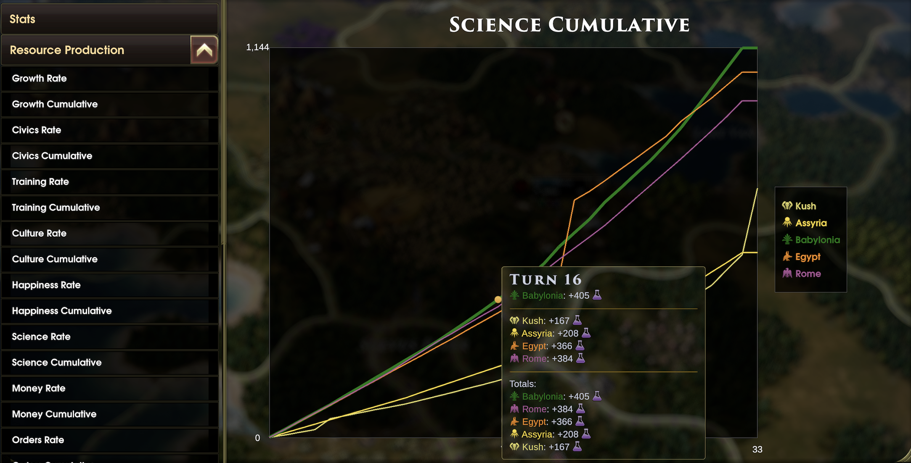

# Cumulative Yields

An [Old World](https://store.steampowered.com/app/597180/Old_World/) mod that adds cumulative (total) production charts to the Stats screen.

## What It Does

The vanilla Stats screen shows per-turn production rates for each yield. This mod adds a **Cumulative** sub-tab next to each existing **Rate** chart, showing total production accumulated over the entire game.

Yields covered: Growth, Civics, Training, Culture, Happiness, Science, Money, Orders, Food, Iron, Stone, and Wood.

No gameplay changes — purely informational.

## Installation

Subscribe on [Steam Workshop](https://steamcommunity.com/sharedfiles/filedetails/?id=3671045125) or [mod.io](https://mod.io/g/oldworld/m/cumulative-yields), or copy the mod folder to your Old World mods directory manually.

## Compatibility

- Single-player and multiplayer
- No DLC required
- No known mod conflicts
